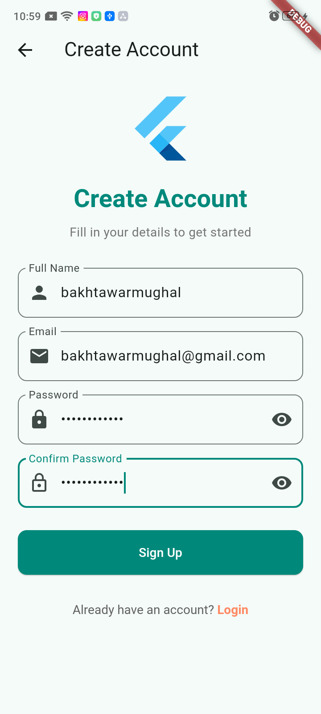
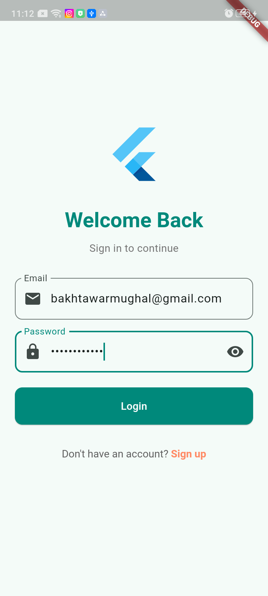
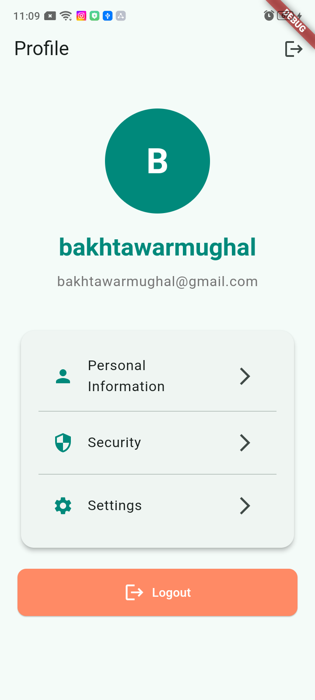

## Firebase Task Manager App
A modern, feature-rich task management application built with Flutter and powered by Firebase.

## 🚀 Features
User Authentication: Secure email/password sign-up and login

Task Management: Create, read, update, and delete tasks

Real-time Updates: Instant synchronization across devices

Modern UI: Beautiful gradient design with smooth animations

State Management: Efficient state handling using Provider package

## 🛠️ Tech Stack
Frontend: Flutter (Dart)

Backend: Firebase

State Management: Provider

## 📦 Firebase Services Used
Firebase Authentication - Email/Password authentication

Cloud Firestore - Real-time database for task storage

Firebase Security Rules - Data protection and user authorization

📱 Screenshots

author: Bakhtawar Alias Rimsha